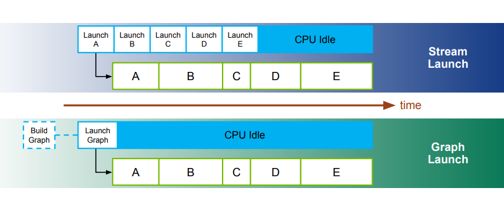
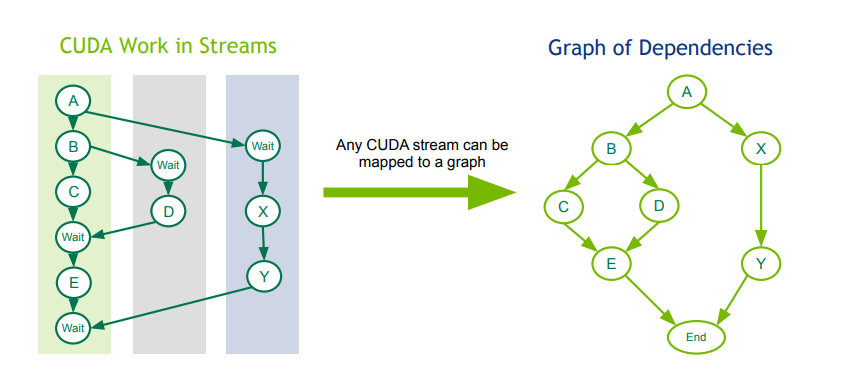
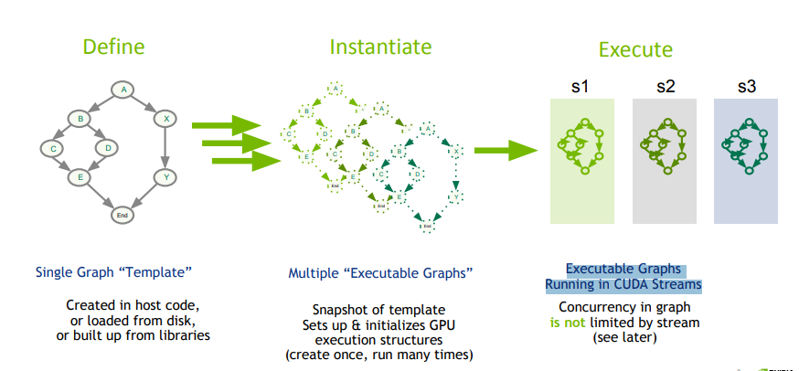
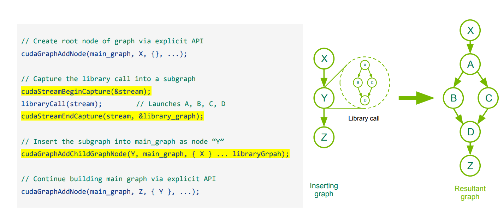
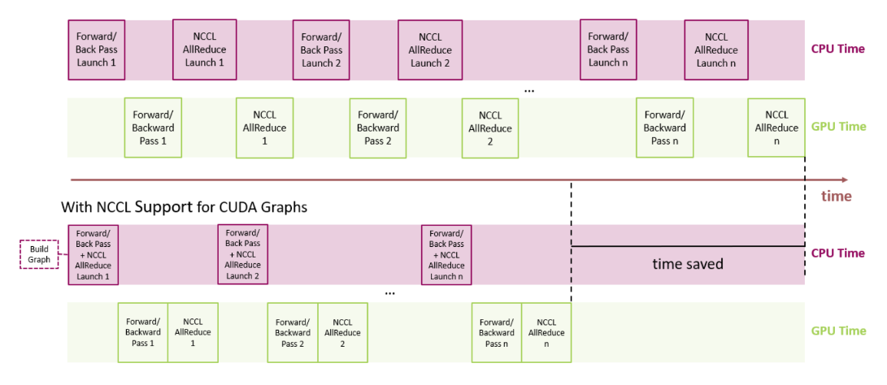

With advancements in GPU hardware and software, CPU overhead in launching CUDA kernels is beginning to become a bottleneck. This is especially observed in many HPC applications as deep neural network training and scientific simulations. Workloads using Python instead of C++ also experience this bottleneck [compared to C++, Python is 5x slower]. 

And while there are a few solutions to this bottleneck, this post is about CUDA Graphs.

<b> Table of Contents </b>

## Why do I need this?

For GPU kernels with short runtimes, CPU Launch time becomes an overhead. Separating out the definition of a graph from its execution reduces CPU kernel launch costs and can make a significant performance difference in such cases.

One can obviously make the case that this overhead can perhaps be removed by overlaping the launch of the kernel with the execution of another independent kernal. And while this is true, the overhead still exists, associated to multiple launches, as they would still require a separate launch operation for each kernel, where each is oblivious to the presence of the others. 

Another means of solving this problem is to write fused kernels, but that is cumbersome. 

CUDA Graphs have been designed to allow work to be defined as graphs rather than single operations. They address the above issue by providing a mechanism to launch multiple GPU operations through a single CPU operation, and hence reduce overheads

Graphs also enable the CUDA driver to perform a number of optimizations because the whole workflow is visible, including execution, data movement, and synchronization interactions, improving execution performance in a variety of cases (depending on the workload).

## What is this? 

CUDA Graphs give you a new manner of submitting your kernels using cuda. 

CUDA operations form the nodes of a graph, with the edges being the dependencies between the operations. All CUDA work essentially forms a graph. This is realised by this data  abstraction.

The operations in the nodes can be:

* **Kernel Launches** :  _CUDA kernel running on GPU_
* **CPU FUNCTION CALLS** :  _Callback function on CPU_
* **Memcopy/Memset** :  _GPU data management_
* **Memory Alloc/Free** :  _Inline memory allocation_
* **Sub-Graph** :  _Graphs are hierarchical_
* **empty node**
* **waiting on an event**
* **recording an event**
* **signalling an external semaphore**
* **waiting on an external semaphore**
* **conditional node**

CUDA 12.3 introduced edge data on CUDA Graphs. Edge data modifies a dependency specified by an edge and consists of three parts: an outgoing port, an incoming port, and a type. An outgoing port specifies when an associated edge is triggered. An incoming port specifies what portion of a node is dependent on an associated edge. A type modifies the relation between the endpoints.

Port values are specific to node type and direction, and edge types may be restricted to specific node types. In all cases, zero-initialized edge data represents default behavior. Outgoing port 0 waits on an entire task, incoming port 0 blocks an entire task, and edge type 0 is associated with a full dependency with memory synchronizing behavior.

## How do I use this?

To use CUDA Graphs:

- **Define a graph** [_created in host code, Loaded from disk or built from libraries_]: 

    During the definition phase, a program creates a description of the operations in the graph along with the dependencies between them.

- **Instantiate the graph** [_Snapshot of template, Sets up & initializes GPU execution structures, (create once, run many times)_]

    Instantiation takes a snapshot of the graph template, validates it, and performs much of the setup and initialization of work with the aim of minimizing what needs to be done at launch. The resulting instance is known as an executable graph.

- **Execute it**

    An executable graph may be launched into a stream, similar to any other CUDA work. It may be launched any number of times without repeating the instantiation.

A graph can be defined by either using StreamCapture mechanism or by defining the nodes and dependencies explicitly through newly available API calls. The Graphs may also span multiple GPUs.  

Stream capture records asynchronous operations without actually launching a kernel. It follows inter-stream
dependencies to create forks & joins. It can be used to construct a graph from normal CUDA stream syntax. It captures calls to external libraries. But if a library calls cudaStreamSynchronize() or any other synchronous operation, stream capture runs into a prolem. Since capture isn't launching anything, synchronize cannot wait for anything and therefore capture fails.

The way around this is to explicitly create the graph using Graph APIs provided by CUDA or to create the graph using stream capture and then capture the library related node using the Graph API.

Graphs can be generated once and executed repeatedly. Data management may be optimized transparently through prefetching, read duplication, subdivision to finer granularity. Since Graphs capture cross-device dependencies, it can be used to optimise multi-device dependencies.
In situations where the workflow is not changing, the overhead of definition and instantiation can be amortized over many executions, and graphs provide a clear advantage over streams.

### Updation of Graphs

In situations where the workflow changes the graph becomes out of date and must be modified. Major changes to graph structure such as topology or types of nodes will require re-instantiation of the source graph because various topology-related optimization techniques must be re-applied.

The cost of repeated instantiation can reduce the overall performance benefit from graph execution, but it is common for only node parameters, such as kernel parameters and cudaMemcpy addresses, to change while graph topology remains the same.[ **So topology can't be updated :( . You have to redo the graph**] For this case, CUDA provides a lightweight mechanism known as “Graph Update,” which allows certain node parameters to be modified in-place without having to rebuild the entire graph. This is much more efficient than re-instantiation.

CUDA also provides a mechanism for enabling and disabling individual nodes without affecting their current parameters.

CUDA provides two mechanisms for updating instantiated graph parameters, whole graph update and individual node update. Whole graph update allows the user to supply a topologically identical cudaGraph_t object whose nodes contain updated parameters. Individual node update allows the user to explicitly update the parameters of individual nodes. Using an updated cudaGraph_t is more convenient when a large number of nodes are being updated, or when the graph topology is unknown to the caller (i.e., The graph resulted from stream capture of a library call). Using individual node update is preferred when the number of changes is small and the user has the handles to the nodes requiring updates. Individual node update skips the topology checks and comparisons for unchanged nodes, so it can be more efficient in many cases.

However, there are some limitations to how certain graph nodes can and cannot be updated. For more details, please check out [this link](https://docs.nvidia.com/cuda/cuda-c-programming-guide/index.html#cuda-graphs), it is a fantastice resource.

## Device Graph Requirements

**General requirements:**

* The graph’s nodes must all reside on a single device.
* The graph can only contain kernel nodes, memcpy nodes, memset nodes, and child graph nodes.

**Kernel nodes:**

* Use of CUDA Dynamic Parallelism by kernels in the graph is not permitted.
* Cooperative launches are permitted so long as MPS is not in use.

**Memcpy nodes:**

* Only copies involving device memory and/or pinned device-mapped host memory are permitted.
* Copies involving CUDA arrays are not permitted.

## NCCL SUPPORT FOR CUDA GRAPHS

Recent releases have seen the adoption of CUDA Graphs for NCCL calls. NCCL enables GPU-based collective and P2P communications. 

For distributed multi-GPU workloads, NCCL is used for collective communications. If we look at training a neural network that leverages data parallelism, without NCCL support for CUDA graphs, we’ll need a separate launch for each of forward/back propagation and NCCL AllReduce. By contrast, with NCCL support for CUDA graphs, we can reduce launch overhead by lumping together the forward/backward propagation and NCCL AllReduce all in a single graph launch. Starting with NCCL 2.11, when NCCL communication is captured and the CollNet algorithm is used, NCCL allows for further performance improvement via user buffer registration. 

Having multiple outstanding NCCL operations that are any combination of graph-captured or non-captured is supported. There is a caveat that the mechanism NCCL uses internally to accomplish this has been seen to cause CUDA to deadlock when the graphs of multiple communicators are cudaGraphLaunch()’d from the same thread

## PyTorch + CUDA Graphs

PyTorch announced its adoption of CUDA Graph into advanced features to accelerate DL features. 

PyTorch supports the construction of CUDA graphs using stream capture, which puts a CUDA stream in capture mode. CUDA work issued to a capturing stream doesn’t actually run on the GPU. Instead, the work is recorded in a graph. After capture, the graph can be launched to run the GPU work as many times as needed.

Each replay runs the same kernels with the same arguments. For pointer arguments this means the same memory addresses are used. By filling input memory with new data (e.g., from a new batch) before each replay, you can rerun the same work on new data.

A graph’s arguments and kernels are fixed, so a graph replay skips all layers of argument setup and kernel dispatch, including Python, C++, and CUDA driver overheads. Under the hood, a replay submits the entire graph’s work to the GPU with a single call to cudaGraphLaunch. Kernels in a replay also execute slightly faster on the GPU, but eliding CPU overhead is the main benefit.

**Constraints**

A set of ops is capturable if it doesn’t violate any of the following constraints:

- Capture must occur on a non-default stream. 
- Ops that synchronize the CPU with the GPU (e.g., .item() calls) are prohibited.
- CUDA RNG ops are allowed, but must use default generators. For example, explicitly constructing a new torch.Generator instance and passing it as the generator argument to an RNG function is prohibited.

_Violating any of the above will likely cause a runtime error_

- Within a process, only one capture may be underway at a time.
- No non-captured CUDA work may run in this process (on any thread) while capture is underway.
- CPU work is not captured. If the captured ops include CPU work, that work will be elided during replay.
- Every replay reads from and writes to the same (virtual) memory addresses.
- Dynamic control flow (based on CPU or GPU data) is prohibited.
- Dynamic shapes are prohibited. The graph assumes every tensor in the captured op sequence has the same size and layout in every replay.
- Using multiple streams in a capture is allowed, but there are restrictions.

_Violating any of the above will likely cause silent numerical errors or undefined behavior_

**Non-constraints**

Once captured, the graph may be replayed on any stream.

### Some interesting resources

-  https://github.com/olcf/cuda-training-series/blob/master/exercises/hw13/README.md
- https://www.nvidia.com/en-us/on-demand/session/gtcspring21-s32082/
- https://github.com/NVIDIA/cuda-samples/tree/master/Samples/3_CUDA_Features/simpleCudaGraphs

## References

[1]  https://developer.nvidia.com/blog/cuda-10-features-revealed/

[2]  https://developer.nvidia.com/blog/cuda-graphs/

[3]  https://www.olcf.ornl.gov/wp-content/uploads/2021/10/013_CUDA_Graphs.pdf

[4]  https://docs.nvidia.com/cuda/cuda-c-programming-guide/index.html#graph-structure

[5]  https://docs.nvidia.com/deeplearning/nccl/user-guide/docs/usage/cudagraph.html

[6]  https://pytorch.org/blog/accelerating-pytorch-with-cuda-graphs/

[7] https://pytorch.org/docs/master/notes/cuda.html#cuda-graphs