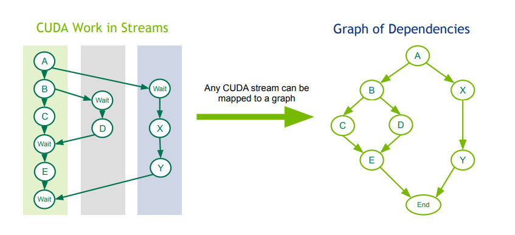

With advancements in GPU hardware and software, CPU overhead in launching CUDA kernels is beginning to become a bottleneck. This is especially observed in many HPC applications as deep neural network training and scientific simulations. Workloads using Python instead of C++ also experience this bottleneck [compared to C++, Python is 5x slower]. 

And while there are a few solutions to this bottleneck, this post is about CUDA Graphs.

### Table 

## Why do I need this?

For GPU kernels with short runtimes, CPU Launch time becomes an overhead. Separating out the definition of a graph from its execution reduces CPU kernel launch costs and can make a significant performance difference in such cases. Graphs also enable the CUDA driver to perform a number of optimizations because the whole workflow is visible, including execution, data movement, and synchronization interactions, improving execution performance in a variety of cases (depending on the workload).

## What is this? 

CUDA Graphs give you a new manner of submitting your kernels using cuda. 

CUDA operations form the nodes of a graph, with the edges being the dependencies between the operations. All CUDA work essentially forms a graph. This is realised by this data  abstraction.

The operations in the nodes can be:

## When do I use this?

> ### References
> [1]  https://developer.nvidia.com/blog/cuda-10-features-revealed/
>
> [2]  https://developer.nvidia.com/blog/cuda-graphs/
>
> [3]  

