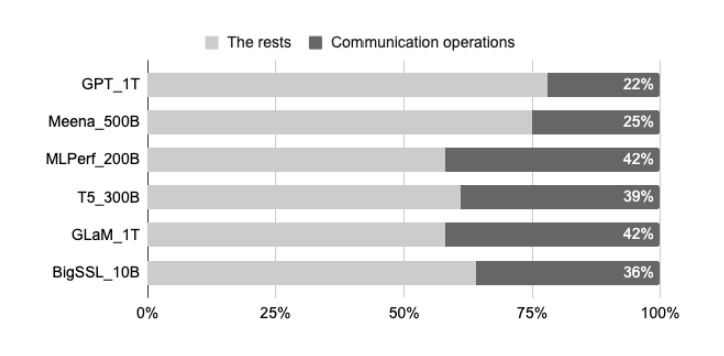
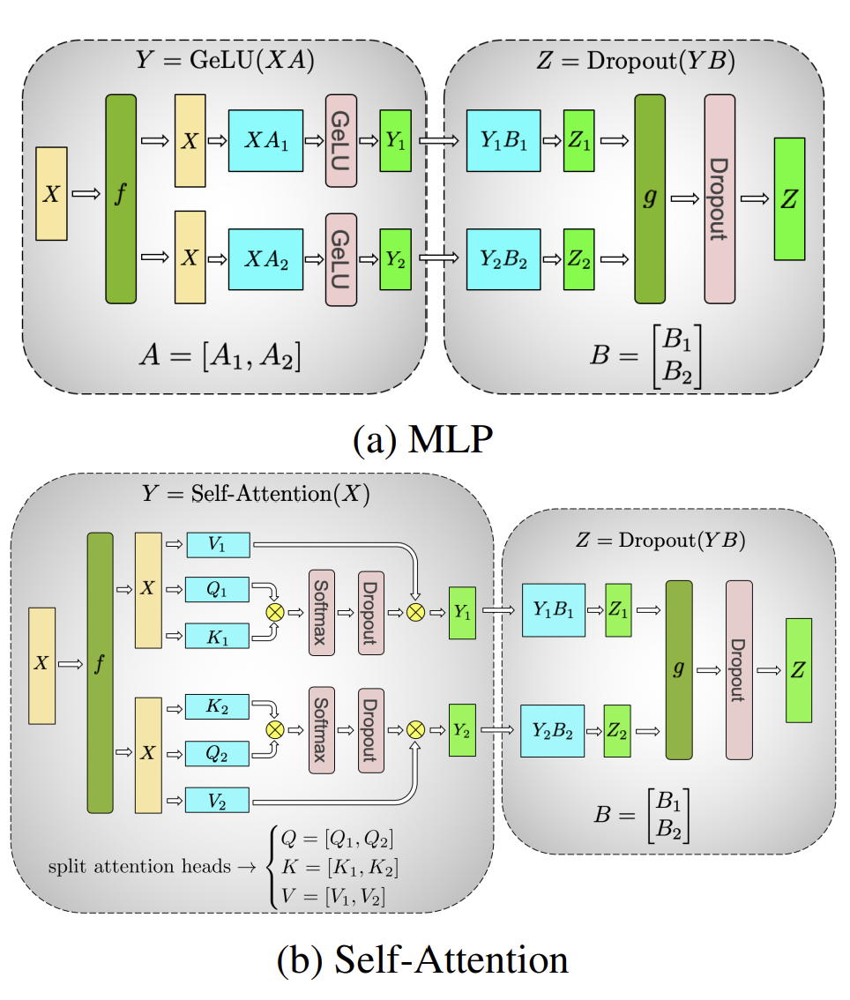
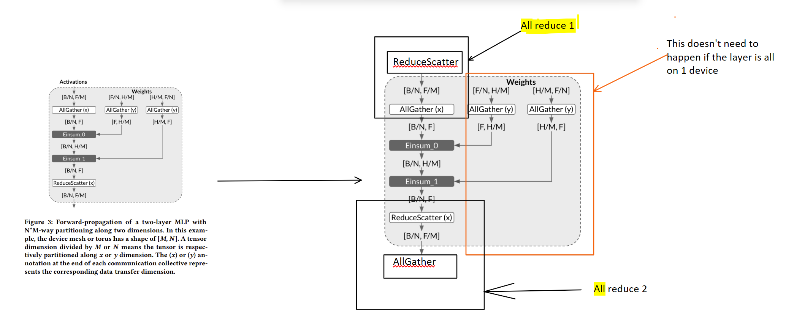
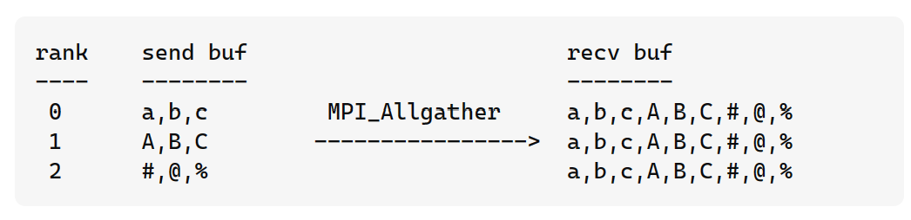
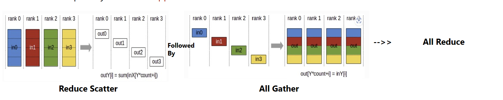
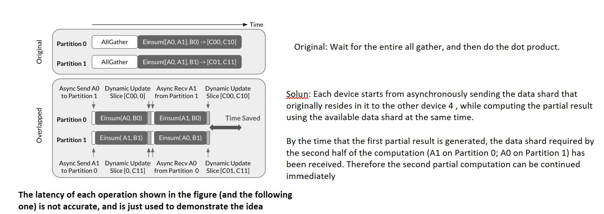
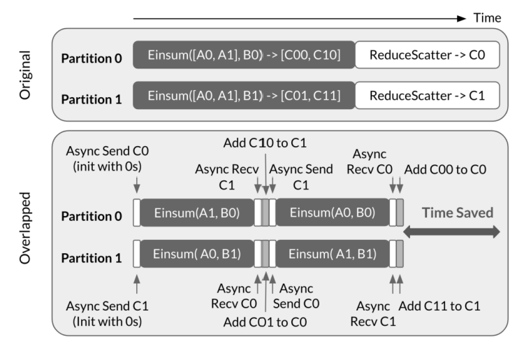
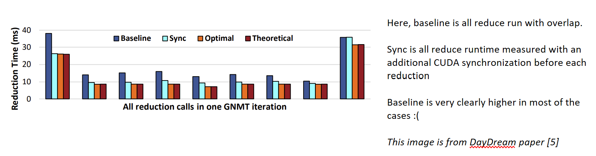

***Basic Idea***  Overlap dependent communications and computations by starting compute on the half of compute inpute that has already been communicated

## Motivation

LLMs require large on device memory. But memory capacity of a Single GPU or TPU is very limited.
To solve this people usually resort to intra-layer model parallelism. But this requires data communication across devices. And this communication contributes to a significant portion of the total execution time and severely hurts the compute efficiency.

The sequential behaviour of most deep learning models make it hard to overlap comm and compute that 
have data dependence.

## Prior Solutions

Applied various loop analysis and transformation techniques (such as loop fission, interchange, tiling, pipelining, strip-mining) to extract loops that only contain independent communication

## Proposed  Solution

The proposed solution uncovers opportunities for dependent communication compute overlap.  The original communication collective is decomposed into sequence of fine grained comm operations along with the dependent computation operation,[how fine grained? The data to be communicated and computed on is sharded]. It then proposes that these ops directly start working on each shard individually instead of waiting for all the units of the data are ready. It makes sure that there is never any data dependency violation.

In order to enable this, a new instruction scheduling scheme is proposed to asynchronously execute the decomposed collectives in parallel with the corresponding finer-grained computation ops in an iterative way

A cost model is also in place to assess the trade-offs of employing this optimization and automatically enables/disables it based on net benefits

The entire implementation is done on XLA, a TPU based ML compiler

## What does communication mean here?

On a GPU, TP implementation normally looks like the following:

Here, f and g are conjugate. f is an identity operator in the forward pass and all reduce in the backward pass while g is an all reduce in the forward pass and identity in the backward pass.

This paper goes one step further and shards the activations and the weights. And construct them on demand using collective primitives.

Usually, usually the AllGather(y) X 2 is not required. Einsum here is just to imply matmul which is the primary operation of a linear layer
 
### Communication Primitive 

• AllGather has a many-to-many communication pattern that each logical device partition receives data from all of the partitions and concatenate them based on the data Partition IDs. It is mostly applied to replicate data along partitioned dimensions
A good way to understand this is:

• Reduce Scatter  has a reverse communication pattern of AllGather. Each logical device partition performs element-wise reduction over the received data partitions with the same Partition ID.

• AllReduce can be considered as a ReduceScatter followed by an AllGather. After the operation, each logical device partition has the same tensor value from element-wise reduction over all of the data inputs, each of which comes from a different logical device partition. 

[why Reduce Scatter + All Gather and not reduce + broadcast?. After a reduce, only one GPU [the root] has all the data. No einsum can start on the other ranks until the broadcast in which case the GPU is idle and there is no overlap to be had]

##  What does deconstructed communication workflow look like?

Similarly,

 C0 (the addition of C00 and C01) and C1 (the addition of C10 and C11)
are respectively the result shard of C after ReduceScatter on Partition 0 and Partition 1. 

As the data communication is performed on the computation result, in this case, each device needs to asynchronously transfer the accumulation result shard rather than the
operand shard. 

The accumulation result shard is initialized with zeros on each device. At the beginning of each iteration, each device asynchronously send the accumulation result shard (e.g., C0 and C1 on Partition 0 and Partition 1, respectively, in the first iteration) to the other device, and start executing the partial Einsum in parallel with the data transfer. [why communicate 0s? it's wasted work :( ]

When the computation finishes, the partial
result is added to the received accumulation result shard at theend of the iteration (e.g., C1 += C10 and C0 += C01 on Partition 0
and Partition 1, respectively, in the first iteration).

But what is the overhead of overlapping communication and compute?

What happens to the compute time? Don't know, TBD

### Some Resources

1. [Overlap Communication with Dependent Computation via Decomposition in Large Deep Learning Models, Proceedings of the 28th ACM International Conference on Architectural Support for Programming Languages and Operating Systems, Volume 1](https://dl.acm.org/doi/pdf/10.1145/3567955.3567959)
   
2. [Lightening Talk at ASPLOS23](https://youtu.be/38TcJ9WE6vU)

## References

[1]  [Overlap Communication with Dependent Computation via Decomposition in Large Deep Learning Models, Proceedings of the 28th ACM International Conference on Architectural Support for Programming Languages and Operating Systems, Volume 1](https://dl.acm.org/doi/pdf/10.1145/3567955.3567959)

[2]  [mpi - Difference between MPI_Allgather and MPI_Alltoall functions? - Stack Overflow](https://stackoverflow.com/questions/15049190/difference-between-mpi-allgather-and-mpi-alltoall-functions)

[3]  [Megatron-LM: Training Multi-Billion Parameter Language Models Using Model Parallelism (arxiv.org)](https://arxiv.org/pdf/1909.08053.pdf)

[4]  [Operations — NCCL 2.6.4 documentation (nvidia.com)](https://docs.nvidia.com/deeplearning/nccl/user-guide/docs/usage/operations.html#reduce)

[5] [Daydream: Accurately Estimating the Efficacy of Optimizations for DNN Training](https://arxiv.org/pdf/2006.03318.pdf)