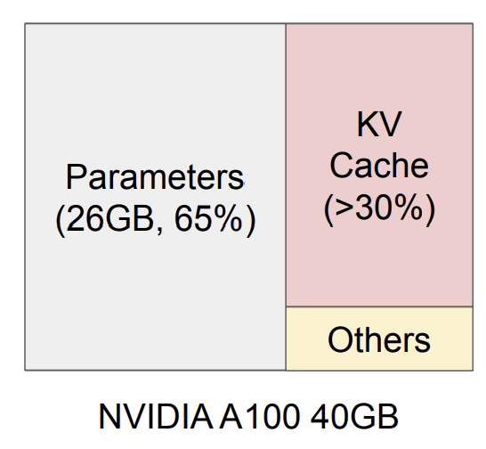
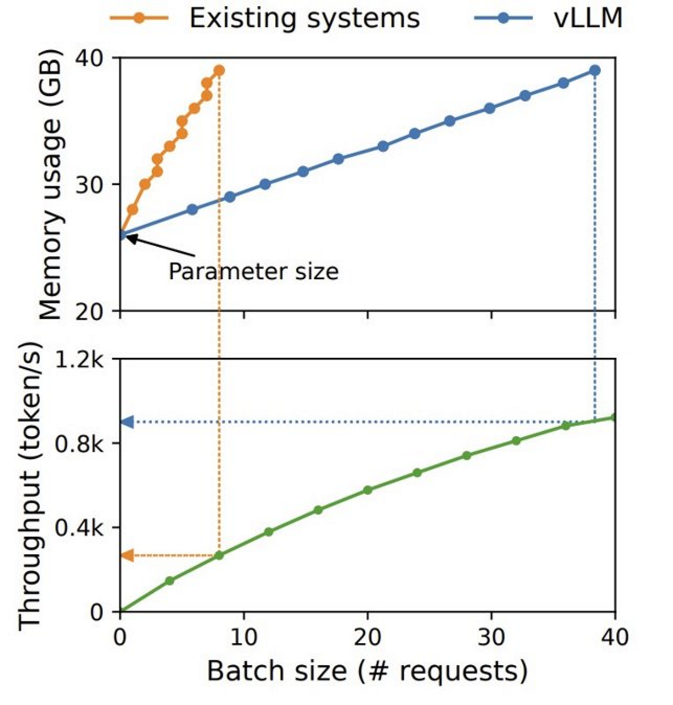
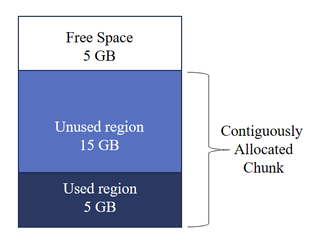
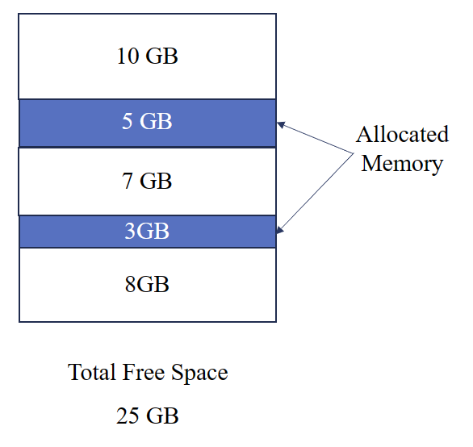

**Basic Idea**: Manage the memory allocated to KV cache more efficiently in the same way that OS manages memory: paging. 

## Motivation

KV cache is a cache that stores key/value embeddings in attention during the prompting stage of LLM inference to reduce repetitive computation. Because of this, text generation with LLMs consists of a prefill and a decode phase. Prefill phase refers to the first forward pass over the prompt, where the entire token is processed and the first token is generated. In this step, there is no KV cache as attention embedding for all tokens in the prompt have yet to be processed.

In the decode phase, since there is a KV cache, the LLM only needs to process one token [the last one that had been generated]. But because of this, any time taken in this process is strictly time spent on memory activities.

This means 2 things: 

1. Decode phase doesn't saturate compute.
2. Decode phase is memory bound. 

In order to generate for more prompts, we can make bigger batches. But there is a shortage of memory because of how large the large language models have become. Moreover, larger the batch size, larger the amount of memory used for KV cache.  

<ins>Moral of the story</ins>:  the performance of autoregressive text generation with LLMs is bottlenecked by memory

BUT YOU SEE REAL BENEFITS FROM THIS ONLY IF YOU HAVE A SMALL PROMPT \[PREFILL\] AND A LOT OF TOKENS TO GENERATE [DECODES]

Key-Value Tensors are: 

1. Pre-allocated for maximum sequence length​ [but generated sequence length is not known before hand]
2. Stored contiguously [because DL frameworks need it like that]
3. Number of cached tensors grows linearly with output sequence length​

## Why is the current implementation of KV Cache inefficient?

1. internal fragmentation- space within the pre-allocated contiguous memory region is inaccessible​
   * If num_gen_tokens < max_seq_len, ​space is wasted
   * Even if num_gen_tokens is known, pre-allocation is wasteful because shorter requests can't use any part of the allocated chunk​

  
2. External​ fragmentation - space outside the pre-allocated memory region is inaccessible​. Occurs when there are allocations / deallocations of differing sizes​

			

## So, why not just use compaction?
Compaction is the collection fragmented free blocks into one contiguous block​

1. Too expensive (LLM serving is performance-sensitive)​

2. Doesn't help with internal fragmentation​

3. Doesn't facilitate memory sharing across requests​

## Paged Attention

In Paged Attention, the KV cache of each sequence is divided into blocks, with each block holding the keys and values for a predetermined amount of tokens. The Paged Attention kernel effectively finds and gets these blocks during the attention computation.

vLLM partitions GPU memory into contiguous physical blocks​. Logical blocks are assigned to physical blocks as tokens are generated​. Block tables map logical blocks to physical blocks

 
